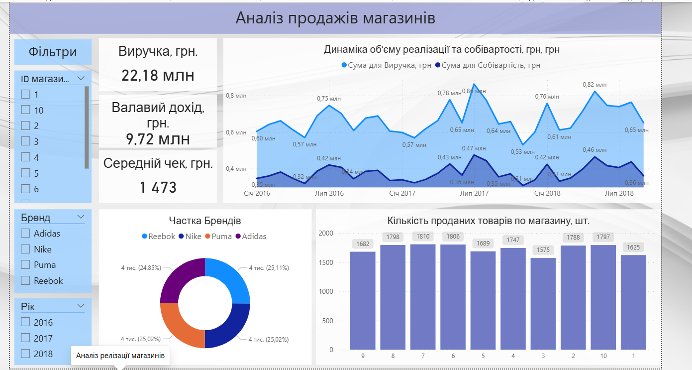

# Аналітичні звіти Power BI

Цей репозиторій містить приклади моїх робіт у Power BI, які демонструють навички аналізу даних, побудови моделей та візуалізації бізнес-показників.

## Проекти у цьому репозиторії

### 1. Аналіз клієнтської бази
Звіт зосереджений на демографічному аналізі клієнтів та ефективності каналів залучення.
* **Ключові інсайти:** розподіл клієнтів за зайнятістю та каналами залучення.

### 2. Аналіз реалізації магазинів
Комплексний аналіз продажів, що включає моніторинг динаміки виручки, собівартості та структури продажів за брендами.
* **Ключові інсайти:** аналіз середнього чека та продуктивності магазинів.

### 3. Аналіз фактичних і планових даних
Звіт для оцінки ефективності виконання бізнес-планів (План/Факт аналіз).
* **Ключові інсайти:** розрахунок відхилень та коефіцієнтів виконання плану.

## Технічні навички:
- **Power BI Desktop:** створення інтерактивних дашбордів.
- **ETL:** очищення, трансформація даних та робота з Power Query.
- **Моделювання:** створення зіркоподібної схеми (Star Schema) та налаштування зв'язків між таблицями.
- **DAX:** написання мір для складних аналітичних розрахунків (KPI, динамічні показники).

---
*Дякую за увагу до моїх проектів. Готовий відповісти на запитання щодо технічної реалізації звітів.*
